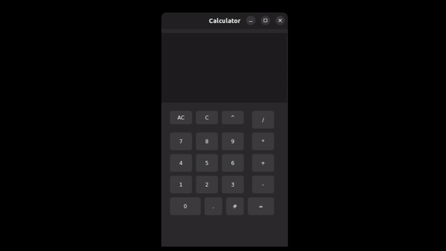

# Calculator with Qt & C++
This is a basic calculator application built using C++ and Qt.

I created this project as part of my journey into building desktop applications with C++. Qt proved to be a wonderful framework — with it, I can easily develop applications for both Linux and Windows.

## Techonlogies

## Preview GIF

### Clone the repository
<pre><code>git clone https://github.com/Akhilesh286/calculator.git
cd calculator/calculator/
</code></pre>

### Run the app
<pre><code>./calculator</code></pre>

## 1. Build the app for linux 

### 2. Install dependencies (Ubuntu/Debian example)
<pre><code>sudo apt update
sudo apt install cmake qt6-base-dev qt6-base-dev-tools build-essential
</code></pre>
### 3. Create build folder
<pre><code>mkdir build
cd build
</code></pre>

### 4. Configure with CMake
<pre><code>cmake .. -DCMAKE_PREFIX_PATH=$(qtpaths --install-prefix)
</code></pre>

### 5. Build the app
<pre><code>cmake --build .
</code></pre>

### 6. Run the app
<pre><code>./calculator
</code></pre>
